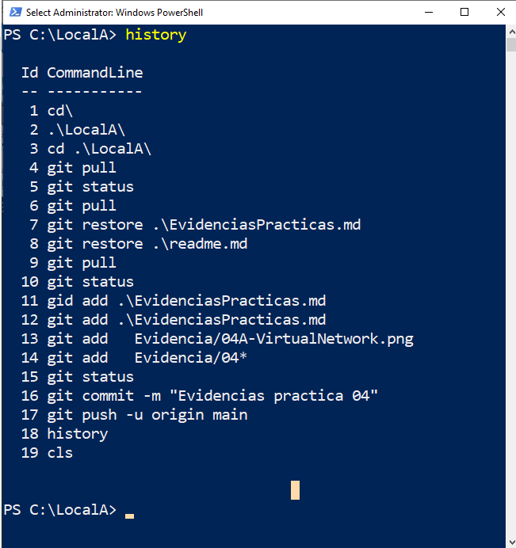

# AZ-900T00 y AZ-900T01: Conceptos básicos de Microsoft Azure


###  Práctica (7,5 horas)                                                         
#### Módulo 01: N/A                                                                     
#### Módulo 02:            

**01 - Crear una máquina virtual en el portal (10 min)**
[ES](Instructions_ES/Walkthroughs/01-Create a virtual machine.md) 
[EN](Instructions_EN/Walkthroughs/01-Create a virtual machine.md) 

**02 - Crear una aplicación web (10 min)**
[ES](Instructions_ES/Walkthroughs/02-Create a Web App.md) 
[EN](Instructions_EN/Walkthroughs/02-Create a Web App.md) 

**03 - Implementar Azure Container Instances  (10 min)**
[ES](Instructions_ES/Walkthroughs/03-Deploy Azure Container Instances.md) 
[EN](Instructions_EN/Walkthroughs/03-Deploy Azure Container Instances.md)    

**04 - Crear una red virtual  (20 min)**
[ES](Instructions_ES/Walkthroughs/04-Create a virtual network.md) 
[EN](Instructions_EN/Walkthroughs/04-Create a virtual network.md)           

**05 - Creación de almacenamiento de blobs  (5 min)**
[ES](Instructions_ES/Walkthroughs/05-Create Blob storage.md) 
[EN](Instructions_EN/Walkthroughs/05-Create Blob storage.md)

**06 - Creación de una base de datos SQL   (5 min)**
[ES](Instructions_ES/Walkthroughs/06-Create a SQL database.md) 
[EN](Instructions_EN/Walkthroughs/06-Create a SQL database.md)

#### Módulo 03:            

**07 - Implementar un Azure IoT Hub (10 min)**
[ES](Instructions_ES/Walkthroughs/07-Implement the Azure IoT Hub.md)
[EN](Instructions_EN/Walkthroughs/07-Implement the Azure IoT Hub.md) 

**08 - Implementar Azure Functions (5 min)**
[ES](Instructions_ES/Walkthroughs/08-Implement Azure Functions.md)
[EN](Instructions_EN/Walkthroughs/08-Implement Azure Functions.md)

**09 - Crear una máquina virtual con una plantilla   (10 min)**
[ES](Instructions_ES/Walkthroughs/09-Create a VM with a Template.md)
[EN](Instructions_EN/Walkthroughs/09-Create a VM with a Template.md) 

**10 - Crear una VM con PowerShell    (10 min)**
[ES](Instructions_ES/Walkthroughs/10-Create a VM with PowerShell.md)
[EN](Instructions_EN/Walkthroughs/10-Create a VM with PowerShell.md)

**11 - Crear una VM con la CLI (10 min)**
[ES](Instructions_ES/Walkthroughs/11-Create a VM with the CLI.md) 
[EN](Instructions_EN/Walkthroughs/11-Create a VM with the CLI.md)

#### Módulo 04:            

**12 - Implementar Azure Key Vault (5 min)**
[ES](Instructions_ES/Walkthroughs/12-Implement Azure Key Vault.md)
[EN](Instructions_EN/Walkthroughs/12-Implement Azure Key Vault.md)

**13 - Tráfico de red segura (10 min)**
[ES](Instructions_ES/Walkthroughs/13-Secure network traffic.md)
[EN](Instructions_EN/Walkthroughs/13-Secure network traffic.md)

#### Módulo 05:

**14 - Administrar el acceso con RBAC (5 min)**
[ES](Instructions_ES/Walkthroughs/14-Manage access with RBAC.md)
[EN](Instructions_EN/Walkthroughs/14-Manage access with RBAC.md)

**15 - Administrar bloqueos de recursos (5 min)**
[ES](Instructions_ES/Walkthroughs/15-Manage resource locks.md) 
[EN](Instructions_EN/Walkthroughs/15-Manage resource locks.md)

**16 - Implementar el etiquetado de recursos (5 min)**
[ES](Instructions_ES/Walkthroughs/16-Implement resource tagging.md)
[EN](Instructions_EN/Walkthroughs/16-Implement resource tagging.md)

**17 - Crear una directiva de Azure (10 min)**
[ES](Instructions_ES/Walkthroughs/17-Create an Azure Policy.md)
[EN](Instructions_EN/Walkthroughs/17-Create an Azure Policy.md)

**18 - Explorar el Centro de confianza (5 min)**
[ES](Instructions_ES/Walkthroughs/18-Explore the Trust Center.md) 
[EN](Instructions_EN/Walkthroughs/18-Explore the Trust Center.md)

#### Módulo 06:


**19 - Usar la calculadora de precios de Azure (10 min)**
[ES](Instructions_ES/Walkthroughs/19-Use the Azure Pricing Calculator.md)
[EN](Instructions_EN/Walkthroughs/19-Use the Azure Pricing Calculator.md)

**20 - Usar la calculadora de TCO de Azure (10 min)**
[ES](Instructions_ES/Walkthroughs/20-Use the Azure TCO Calculator.md)
[EN](Instructions_EN/Walkthroughs/20-Use the Azure TCO Calculator.md)

**21 - Calcular el Acuerdo de nivel de servicio compuesto (5 min)**
[ES](Instructions_ES/Walkthroughs/21-Calculate Composite SLAs.md.md)
[EN](Instructions_EN/Walkthroughs/21-Calculate Composite SLAs.md)

####  N/A                  

**22 - Abrir una solicitud de soporte técnico (5 min)** 
[ES](Instructions_ES/Walkthroughs/22-Open a Support Request.md) 
[EN](Instructions_EN/Walkthroughs/22-Open a Support Request.md)

### Comandos Varios
Algunos comandos para gestionar el repositorio y las evidencias:

 ```powershell
    cd .\LocalA\  --
    git pull
    git status
    git pull
    git restore .\EvidenciasPracticas.md
    git restore .\readme.md
    git pull
    git status
    gid add .\EvidenciasPracticas.md
    git add .\EvidenciasPracticas.md
    git add   Evidencia/04A-VirtualNetwork.png
    git add   Evidencia/04*
    git status
    git commit -m "Evidencias practica 04"
    git push -u origin main
    history
    cls
 ```



